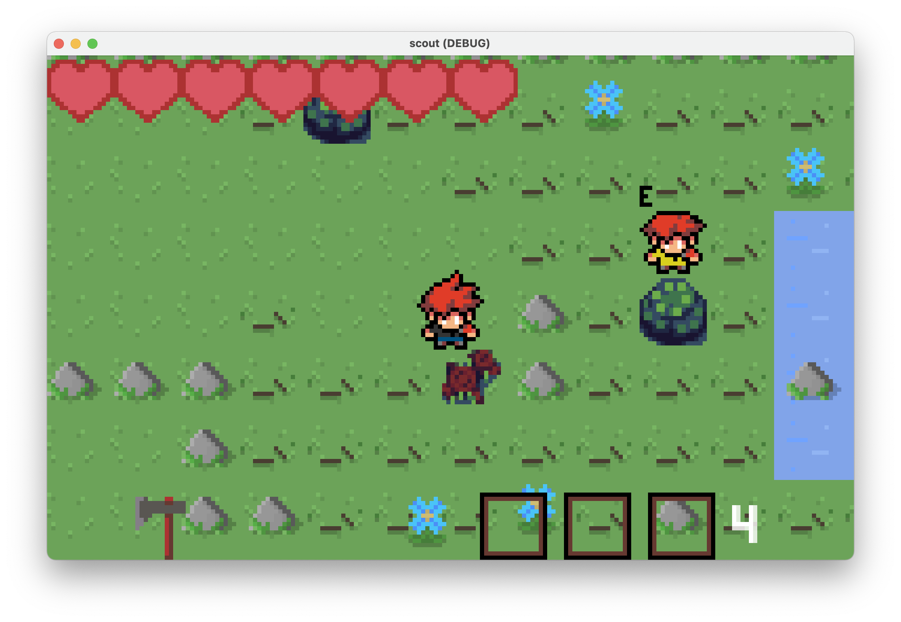

# Scout

Scout é um jogo de aventura top-down inspirado por SteamWorld Dig. O jogo usa o motor Godot 3.6.

## Plot

Um vírus letal se espalhou e você busca flores raras para viabilizar a pesquisa por um antídoto. Ainda que ame a natureza, você vive uma dualidade: para coletar flores raras, você precisa desmatar.

## Controles

- `Espaço` para atacar/destruir
- `E` para interagir com comprador, portal ou item (machado ou picareta)
- `D` para jogar dinamite
